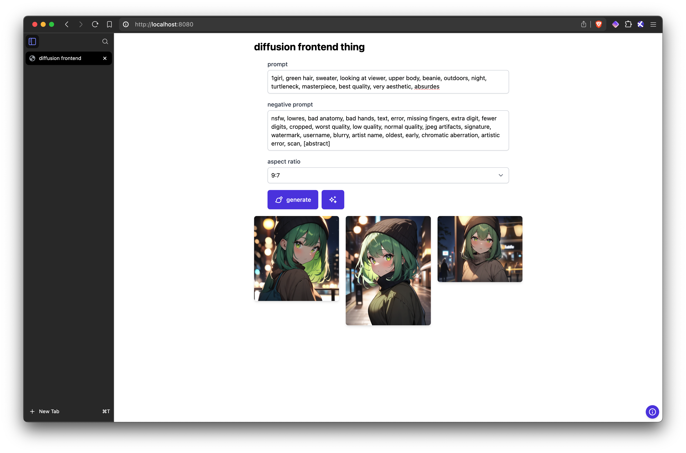

# diffusion frontend thing

this project is a simple frontend for [animagine-xl-3.1](https://huggingface.co/cagliostrolab/animagine-xl-3.1) that i built, in order to test out a simple tag autocomplete/correction system.



## running the project

if you haven't already set up the project, look at the setup guide.

you can run the project automatically with:
```sh
./run.sh
```

or on windows:
```sh
run.bat
```

or alternatively by running the backend script:
```sh
cd backend
python main.py
```

the program accepts a `--device` flag, to set the device that inference is run on. it tries to use `mps` (apple silicon) by default and falls back to `cpu` if unavailable. use `cuda` to run on nvida gpus.

you will probably need somewhere around 16GB of VRAM to run the program?

## setup guide

### automatic

1. clone the repository:
   ```sh
   git clone https://github.com/e74000/diffusion_frontend_thing
   ```
2. open project root:
   ```sh
   cd diffusion_frontend_thing
   ```
3. run the setup script `./init.sh` (alternatively `init.bat` for windows users). you may need to make the script executable,
4. finally you can run the application with `./run.sh` (alternatively `run.bat` for windows users). you may need to make the script executable,

### manual

1. clone the repository:
   ```sh
   git clone https://github.com/e74000/diffusion_frontend_thing
   ```
2. open project root:
   ```sh
   cd diffusion_frontend_thing
   ```

#### frontend

1. open frontend directory:
   ```sh
   cd frontend
   ```
2. install npm dependencies:
   ```sh
   npm install
   ```
3. build the frontend:
   ```sh
   npm run build
   ```
4. return to project root:
   ```sh
   cd ..
   ```

#### backend

1. open backend directory:
   ```sh
   cd backend
   ```
2. init virtual environment:
   ```sh
   python -m venv venv
   ```
3. activate virtual environment:
   ```sh
   source venv/bin/activate
   ```
   on windows you need to use:
   ```sh
   venv\\Scripts\\activate
   ```
4. install python dependencies:
   ```sh
   pip install -r requirements.txt
   ```
5. check if `safe.csv` exists in the backend directory. if it is missing fetch it with:
   ```sh
   curl https://r2.e74000.net/diffusion_frontend_thing/safe.csv
   ```
6. finally you can run the backend script with:
   ```sh
   python main.py
   ```
